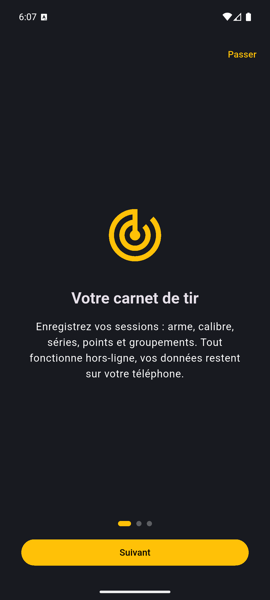
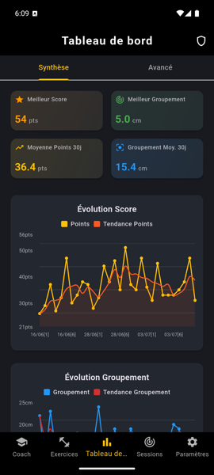
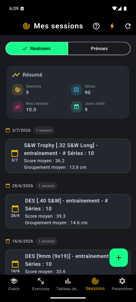
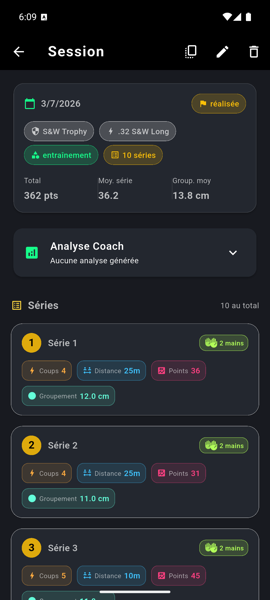
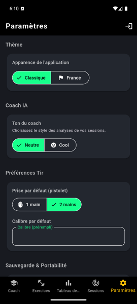
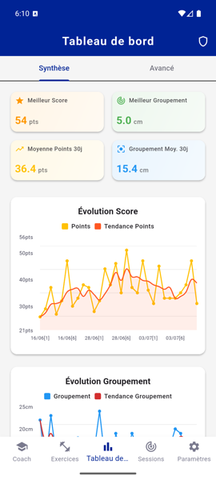

<div align="center">


# NexTarget

**Le carnet de tir sportif intelligent — sessions, statistiques, objectifs et coach IA.**

[](https://github.com/clementseguy/NexTarget-app/tags)
[](https://flutter.dev)
[](https://sonarcloud.io/summary/overall?id=clementseguy_NexTarget-app)
[](https://sonarcloud.io/summary/overall?id=clementseguy_NexTarget-app)
[](https://sonarcloud.io/summary/overall?id=clementseguy_NexTarget-app)
[](https://sonarcloud.io/summary/overall?id=clementseguy_NexTarget-app)

*Fonctionne 100 % hors-ligne · vos données restent sur votre téléphone · le coach IA en option avec un compte*

</div>

---

## 📱 Aperçu

| Onboarding | Tableau de bord | Sessions |
|:---:|:---:|:---:|
|  |  |  |

| Détail de session | Paramètres & Coach IA | Thème « France » |
|:---:|:---:|:---:|
|  |  |  |

## ✨ Fonctionnalités

- 🎯 **Carnet de tir complet** — sessions (arme, calibre, catégorie), séries détaillées (coups, distance, points, groupement, prise 1/2 mains), sessions prévues et assistant de conversion en réalisées.
- 📊 **Statistiques riches** — records, moyennes glissantes 30/60 j, évolution score & groupement, distributions, corrélations, indice de régularité.
- 🏆 **Objectifs mesurables** — cibles chiffrées (score, groupement…), progression automatique, hauts faits.
- 🏋️ **Exercices** — catalogue d'entraînements (stand/maison) avec consignes, reliés aux objectifs et aux sessions ; planification en un geste.
- 🤖 **Coach IA** — analyse personnalisée de chaque séance (via [NexTarget-server](https://github.com/clementseguy/NexTarget-server) et Mistral), ton **neutre** ou **cool** au choix. Nécessite un compte (connexion Google) ; **aucune clé API côté client**.
- 🇫🇷 **Thèmes** — sombre « Classique » et clair « France ».
- 🔒 **Vie privée par défaut** — stockage local (Hive), compte optionnel, export/import JSON.

## 🚀 Démarrage rapide

```bash
# Prérequis : Flutter 3.35+ (https://docs.flutter.dev/get-started/install)
flutter pub get
flutter run          # émulateur ou appareil Android
```

Build APK de release (aucun secret à injecter) :

```bash
./scripts/build_apk.sh
```

## 🧠 Coach IA (connecté uniquement)

L'analyse coach passe **exclusivement** par [NexTarget-server](https://github.com/clementseguy/NexTarget-server)
(`POST /coach/analyze-session`, JWT requis). Le serveur détient la clé Mistral et
le prompt : **aucune clé API ni secret côté client**, y compris dans les builds.
Sans compte, la section « Analyse Coach » affiche un message clair et un bouton
de connexion ; tout le reste de l'app fonctionne hors-ligne.

L'URL du serveur se configure dans `assets/config.yaml` (`auth.base_url`).
Pour une recette contre un serveur local : `base_url: "http://localhost:8000"`
+ `adb reverse tcp:8000 tcp:8000` (ne pas committer cette valeur).
Un fichier `assets/config.example.yaml` est fourni comme modèle.

## 🛠️ Qualité

| Garde-fou | Détail |
|---|---|
| Analyse statique | `flutter_lints` actif, zéro issue exigé (`flutter analyze --fatal-infos` en CI) |
| Tests | 220+ tests unitaires & widgets (`flutter test`) |
| CI | GitHub Actions + SonarCloud (push `dev`/`main`, PR vers `main`) |
| Pré-commit | `./scripts/verify_before_commit.sh` (analyse + tests, variante `fast`) — hook : `ln -sf ../../scripts/verify_before_commit.sh .git/hooks/pre-commit` |
| Recette manuelle | [Cahier de recette](docs/tests/cahier_recette.md) généré depuis `docs/tests/cahier_recette.yaml` (`dart run scripts/generate_cahier_recette.dart`), à rejouer avant toute MR vers `main` |

## 📚 Documentation

- [Backlog unifié](docs/backlog/backlog-unifie.md) — source de vérité produit (items `NT-XXX`)
- [Notes de version](docs/releases/) · [CHANGELOG](CHANGELOG.md)
- [Docs techniques](docs/tech/) · [Docs fonctionnelles](docs/features/)
- [AGENTS.md](AGENTS.md) — conventions d'architecture et de contribution
- Backend : [NexTarget-server](https://github.com/clementseguy/NexTarget-server) (FastAPI — OAuth, proxy coach IA)

---

<div align="center">
<sub>Astuce émulateur : <code>emulator -avd Pixel_8 -dns-server 8.8.8.8,8.8.4.4 &</code> puis <code>flutter run -d emulator-5554</code></sub>
</div>
